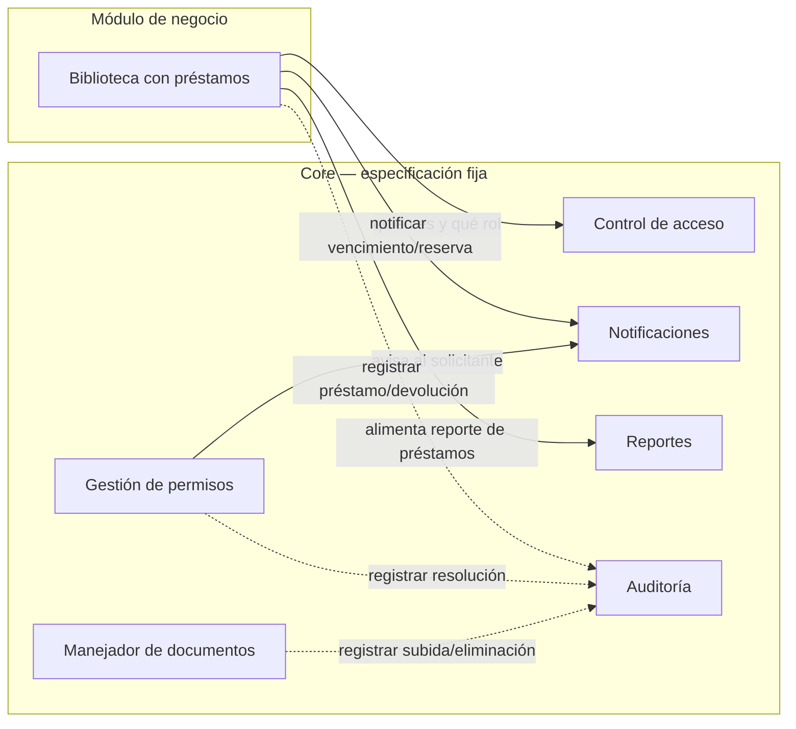

# BibliotecaCore

Proyecto final de Programación III (ITLA, 2026-C-3): un Core compartido, más el módulo de negocio propio, **Biblioteca con préstamos**.

## Diagrama de componentes

Nivel 3 (C4): cada caja es un componente con responsabilidad única; cada flecha es una interfaz etiquetada con su propósito, no con el verbo técnico.



### Responsabilidad de cada pieza

| Pieza | Responsabilidad |
|---|---|
| Control de acceso | Autenticar usuarios y decir qué rol tienen |
| Gestión de permisos | Recibir solicitudes de acceso elevado, aprobarlas o rechazarlas, y aplicar el cambio |
| Manejador de documentos | Subir, listar, descargar y eliminar (borrado lógico) documentos |
| Notificaciones | Guardar y entregar avisos internos y por correo |
| Reportes | Agregación sobre el Core y sobre el negocio, respetando el rol de quien consulta |
| Auditoría | Registrar quién hizo qué y cuándo, de solo lectura |
| Biblioteca con préstamos | Catalogar libros y ejemplares, y controlar el ciclo de préstamo/devolución/reserva |

### Qué cruza la frontera Core ↔ negocio

- El módulo de negocio **pregunta** identidad y rol a Control de acceso; nunca los calcula.
- El módulo **dispara** notificaciones y **alimenta** reportes y auditoría.
- El Core **no conoce** las entidades del negocio (Libro, Ejemplar, Prestamo, Reserva) ni las importa.
- La máquina de estados de Prestamo es independiente de la de SolicitudPermiso.

Prueba mental: si el módulo de negocio se cambiara por otro del catálogo, ninguna línea del Core tendría que tocarse.


## Instrucciones de ejecución

1. Clonar el repositorio:
   ```bash
   git clone [https://github.com/EuryCuevas/Proyecto-Biblioteca-con-prestamos.git](https://github.com/EuryCuevas/Proyecto-Biblioteca-con-prestamos.git)

Restaurar dependencias:

Bash
dotnet restore

Compilar y ejecutar la aplicación:

Bash
dotnet run